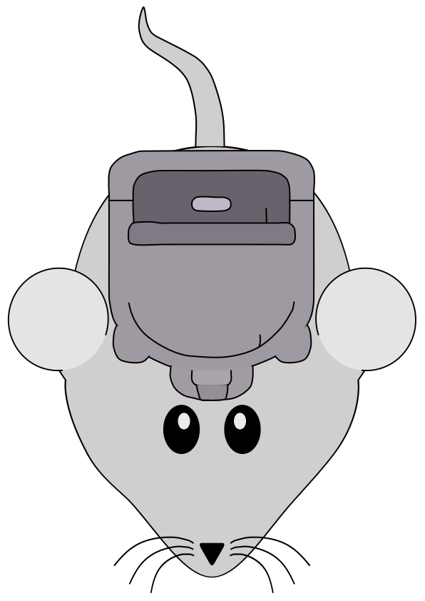

# Packateer


# What is this?

This is a library which will take a filename (the entry argument), use webpack to compile that JSX file into a website.
Then use the WebpackDevServer to host it. It follows this up by creating a puppeteer browser and loading a page to the
site this library just hosted.

You are then provided the pupeteer and webpack dev server variables to test to your hearts content.

This is useful when you need to test interaction with React components that cannot be tested with available
virtual DOM options. One such example is shown below, testing tabIndex.

# Why is this useful?

Say you have a or a few React components that you need to test some user interaction with. Say Drag-n-drop or tab ordering. Then this is a library you may want to give a look.

It allows you to craft a new tsx or jsx file with these components in whichever way you want and then use puppeteer to (and whichever test tool, say Jest) you want to test away.

# Example Usage

### App.test.js

```
import { CreateServerAndClient } from 'packateer';
import * as path from 'path';
import * as util from 'util';

jest.setTimeout(50000); 


function findFocusedNodes(node) {
  if (node.focused) {
    return [node]
  } else if (node.children && node.children.length) {
    // Array.prototype.flatMap = function(mapFunction) { return this.map(mapFunction).reduce((a, c) => { return [ ...a, ...(Array.isArray(c) ? c : [c]) ]; }, []) }
    return node.children.map(n => findFocusedNodes(n)).reduce((a, c) => { return [ ...a, ...(Array.isArray(c) ? c : [c]) ]; }, []);
  } else {
    return [];
  }
}

async function delay(delayTime) {
  await new Promise((res, rej) => {
    setTimeout(() => {
      res(true)
    }, delayTime)
  });
}

let [ppage, pserver, pbrowser] = [undefined, undefined, undefined];

describe('test with pup', () => {
  beforeAll(async () => {
    const { port, server, browser, page } = await CreateServerAndClient(undefined, undefined, false, path.join(__dirname, 'App.subpage.jsx'), [path.join(__dirname, '../node_modules')]);
    pserver = server;
    ppage = page;
    pbrowser = browser;
    
  })
  
  afterAll(() => {
    pbrowser.close();
    pserver.close();
  })

  test('renders learn react link', async () => {
    await ppage.waitForSelector('#initial');

    await ppage.focus("#initial");
    await delay(500);
    let snapNode = await ppage.accessibility.snapshot();
    let inFocus = findFocusedNodes(snapNode);
    expect(inFocus.length).toEqual(1);
    expect(inFocus[0].name).toEqual("initial");

    ppage.keyboard.press('Tab');
    await delay(500);
    snapNode = await ppage.accessibility.snapshot();
    inFocus = findFocusedNodes(snapNode);
    expect(inFocus.length).toEqual(1);
    expect(inFocus[0].name).toEqual("First");

    ppage.keyboard.press('Tab');
    await delay(500);
    snapNode = await ppage.accessibility.snapshot();
    inFocus = findFocusedNodes(snapNode);
    expect(inFocus.length).toEqual(1);
    expect(inFocus[0].name).toEqual("Second");
  });

});
```

### App.subpage.jsx

```
import React from 'react';
import ReactDOM from 'react-dom';
import './index.css';
import App from './App';

ReactDOM.render(
    <App />
  ,
  document.getElementById('root')
);
```


### App.js

```
// import React from 'react'
import logo from './logo.svg';
import './App.css';

function App() {
  return (
    <>
    <div id="initial" tabIndex="0">initial</div>
    <div id="First" tabIndex="0">First</div>
    <div id="Second" tabIndex="0">Second</div>
    <div className="App">
      <header className="App-header">
        
        <p>
          Hey, this is a test.
        </p>
        <a
          className="App-link"
          href="https://reactjs.org"
          target="_blank"
          rel="noopener noreferrer"
        >
          Learn React
        </a>
      </header>
    </div>
    </>
  );
}

export default App;
```

I will include this test project in the test folder of this package to show how this can be used.